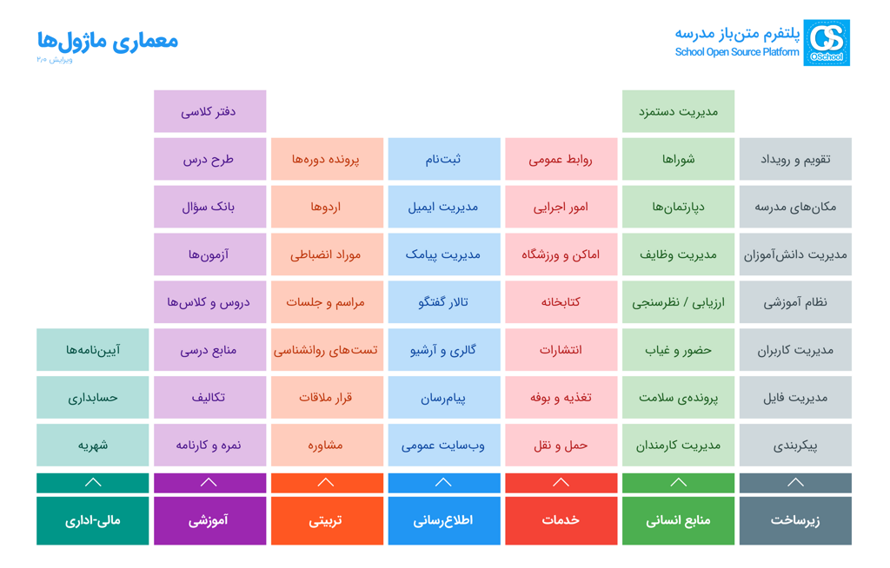

# OSchool
### `Open-Source School Platform` / `پلتفرم متن باز مدرسه` 

## About OSchool / OSchool  درباره

OSchool is an open-source platform that integrates all processes in school or educational institute.

پلتفرم متن بازی است که تمام فرآیندهای مدرسه یا موسسه آموزشی را یکپارچه می کند.

## License / مجوز

The OSchool platform is open-source software created by `Mohammad Reza Vahed`, licensed under the `GNU/GPL` license.

نرم افزاری متن باز است که توسط `محمد رضا واحد` ساخته شده و تحت مجوز `گنو/جی پی ال` می باشد.